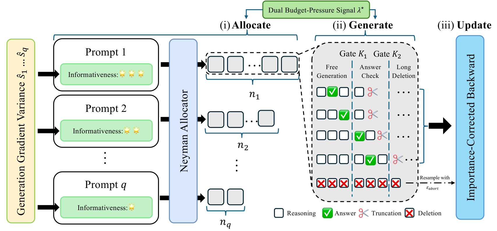

# DUET: Optimize Budget-Token Allocation for Reinforcement Learning with Verifiable Rewards



Reference implementation of **DUET**, a joint allocator that splits a fixed
training-time token budget across prompts (rollout count) *and* within each
rollout (per-prompt max-token cap) under a single Lagrange multiplier.

## Method

DUET solves the cost-weighted Neyman allocation problem online:

$$
\min_{\{n_q,\,L_q\}} \sum_q \frac{\hat{\sigma}_q^{2}}{n_q\,L_q}
\quad\text{s.t.}\quad \sum_q n_q\, L_q \le B,
$$

with a per-prompt informativeness surrogate $\hat\sigma_q$ (ridge fit on
prompt-logprob features, with a Welford-updated online correction
$\hat\sigma_q^{\text{obs}}$ once $\geq k_{\text{warmup}}$ kept rollouts are
seen) and a per-prompt expected-length estimate $\hat L_q$ (online mean over
the K1/K2 quantile window). At inference time, DUET drives per-token
termination via a marker-gated stop processor calibrated against the
informativeness surrogate.

The repository contains:

- The DUET allocator + surrogate + marker-gated stop processor.
- A vendored `verl` runtime patched with the DUET hooks.
- A GRPO baseline (vanilla, no DUET hooks engaged) as the reference comparator.

## Hardware & dependencies

- 1× node, ≥ 8× H100 80 GB (Qwen3-4B uses TP=2; Qwen3-1.7B uses TP=1).
- Python 3.12, CUDA 13 host, `cu128` PyTorch wheels.
- `torch==2.7.0`, `verl==0.4.1`, `vllm==0.9.x`, `ray==2.54`, `tensordict==0.6.2`,
  `flash-attn>=2.7.4,<3` (currently resolves to `2.7.4.post1`).

DUET requires **vLLM V0** because per-request `LogitsProcessors` are not
supported under V1 in vLLM 0.9.2. `scripts/run_duet.sh` exports
`VLLM_USE_V1=0` before vLLM is imported.

## Setup

```bash
git clone <this-repo> duet-code-repo && cd duet-code-repo

# 1. Create venv, install torch/vllm/verl/flash-attn.
bash scripts/setup/install.sh

# 2. Activate (fixes nvjitlink shim + adds src/ + src/verl_runtime to PYTHONPATH).
source scripts/setup/activate.sh

# 3. Authenticate with HuggingFace. Required to fetch:
#      - GPQA-Diamond (Idavidrein/gpqa is a gated dataset),
#      - llama3.2-3b-instruct (also gated).
# Skip only if you need neither.
huggingface-cli login

# 4. Download supported models (default = qwen3-1.7b-base only).
python scripts/setup/download_models.py --model qwen3-1.7b-base
# or all three anchored models:
python scripts/setup/download_models.py --all

# 5. Build datasets (train + eval suite).
python scripts/setup/download_datasets.py --all
```

Models land under `model_checkpoints/<alias>/`, datasets under
`datasets/<name>.jsonl` (6 files: `math_train_clean.jsonl`, `math500_full.jsonl`,
`aime2024_full.jsonl`, `gsm8k_test.jsonl`, `humaneval_full.jsonl`,
`gpqa_diamond.jsonl`).

## Quick start

The default training corpus is `math-train-clean` (≈ 7.5k cleaned MATH
problems); validation runs on `math500` plus four additional suites
(`aime2024-full`, `gsm8k-test`, `humaneval-full`, `gpqa-diamond`).

```bash
# GRPO reference baseline on Qwen3-1.7B-Base (default model).
bash scripts/run_grpo.sh

# DUET on Qwen3-1.7B-Base, sweep three token budgets.
bash scripts/run_duet.sh
DUET_BUDGET=0.25 bash scripts/run_duet.sh
DUET_BUDGET=1.0  bash scripts/run_duet.sh
```

Switch the backbone via the `MODEL` env var:

```bash
MODEL=qwen3-4b-base       bash scripts/run_duet.sh
MODEL=llama3.2-3b-instruct bash scripts/run_duet.sh
```

`scripts/_model_config.sh` anchors the safe (`gpu_memory_utilization`,
`max_num_seqs`, `tensor_model_parallel_size`) defaults for each of the three
supported models. To launch on a different backbone, add a branch to the
`apply_model_config` switch.

## What gets produced

Every run writes:

- `experiments/YYYYMMDD/duet_run_<tag>/checkpoints/` — verl checkpoint dir.
- `experiments/YYYYMMDD/duet_run_<tag>/tensorboard/` — TB event files.
- `experiments/YYYYMMDD/duet_run_<tag>/train.log` — full driver log.
- `verl_workspace/duet/generated/run_duet_verl_<tag>.sh` — the resolved
  launcher (re-runnable standalone).

DUET-specific TB scalars (visible from step ≈ K-warmup onward):

```
duet/n_q_{mean,std,min,max}
duet/L_hat_per_prompt_{mean,std,min,max}
duet/s_hat_per_prompt_{mean,std,min,max}
duet/k1, duet/k2
duet/n_epsilon_kept, duet/epsilon_kept_rate
duet/divisibility_mode
```

> **Note on the tqdm step-time estimate.** The progress-bar wall-clock per
> step (e.g. `73/232 [49:24<1:16:26, 28.84s/it]`) is **not** the pure
> training step time. It is amortized over training **plus periodic
> validation** — every `--test-freq` steps (default 30) verl runs the full
> 5-dataset eval suite (≈ several minutes per pass), which inflates the
> averaged `s/it`. To compare DUET vs GRPO step cost, read
> `timing/gen_per_step` and `timing/update_per_step` from TensorBoard
> instead, or set `--test-freq 0` for a pure-training run.

## DUET hyperparameters

The defaults reproduce the paper. Override with environment variables to
`scripts/run_duet.sh`:

| Var                  | Default    | Meaning |
|---                   |---         |---|
| `DUET_BUDGET`         | `0.5`               | $B/B_{\text{full}}$, fraction of GRPO's full-budget step |
| `DUET_SURROGATE`      | `outputs/duet/ridge_weights.json` | path to pre-fit ridge weights |
| `DUET_K_WARMUP`       | `1`                 | observations needed before $\hat\sigma_q^{\text{obs}}$ replaces ridge |
| `DUET_STOP_SIGNAL`    | `margin`            | per-token stop signal: `margin` (max − 2nd-max prob) is the working default. `max_prob` collapses to floor on a base model. |
| `DUET_THRESHOLD_MODE` | `batch_percentile`  | per-prompt threshold mapping. `batch_percentile` distributes thresholds across the [floor, ceiling] band by batch rank. `linear` collapses to floor when the surrogate is uncalibrated. |
| `DUET_STOP_FLOOR`     | `0.5`               | minimum stop threshold |
| `DUET_MIN_TOKENS`     | `200`               | hard min response length before the stop processor can fire |
| `DUET_HYSTERESIS_K`   | `5`                 | require K consecutive past-threshold tokens before forcing EOS |
| `DUET_MARKER_DOMAIN`  | `math`              | `math` / `code` / `generic` enable marker-gated abort; `none` = allocator + per-token stop only |
| `DUET_GRACE_WINDOW`   | `150`               | tokens past K2 before marker abort fires |
| `DUET_ABORT_EPS`      | `0.05`              | ε-keep rate for no-marker rollouts (SNIPS unbiasedness) |
| `MODEL`              | `qwen3-1.7b-base` | model alias |
| `SEED`               | `0`        | global seed |
| `TAG`                | auto-derived | run tag (TB experiment name) |

## Extending

- **New model**: add a `MODEL_SPECS` entry in `src/duet/model_store.py` and a
  case in `scripts/_model_config.sh`.
- **New dataset**: add a handler in `scripts/setup/download_datasets.py` and
  the alias mapping in `src/duet/data_utils.py`.

## Repository layout

```
duet-code-repo/
├── README.md
├── figure/
│   └── schematics-ver6.png           # method figure (rendered above)
├── scripts/
│   ├── run_grpo.sh                   # GRPO reference launcher
│   ├── run_duet.sh                   # DUET launcher (forces vLLM V0)
│   ├── _model_config.sh              # per-model anchored overrides
│   └── setup/
│       ├── install.sh                # venv + torch + vllm + verl
│       ├── activate.sh               # venv + LD_LIBRARY_PATH
│       ├── requirements.txt
│       ├── download_models.py        # qwen3-{1.7b,4b}-base, llama3.2-3b-instruct
│       └── download_datasets.py      # math train + 5 eval suites
└── src/
    ├── run_duet_verl.py              # CLI entry → pipeline → verl
    ├── duet/                         # DUET package
    │   ├── duet_allocator.py
    │   ├── duet_surrogate.py
    │   ├── duet_logits_processor.py
    │   ├── duet_marker_detector.py
    │   ├── duet_prompt_state.py
    │   ├── data_utils.py
    │   ├── model_store.py
    │   └── pipeline.py               # generates the verl launcher .sh
    └── verl_runtime/verl/            # vendored verl + DUET surgical patches
```
